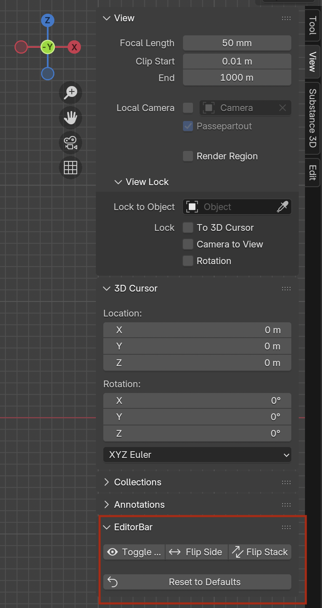
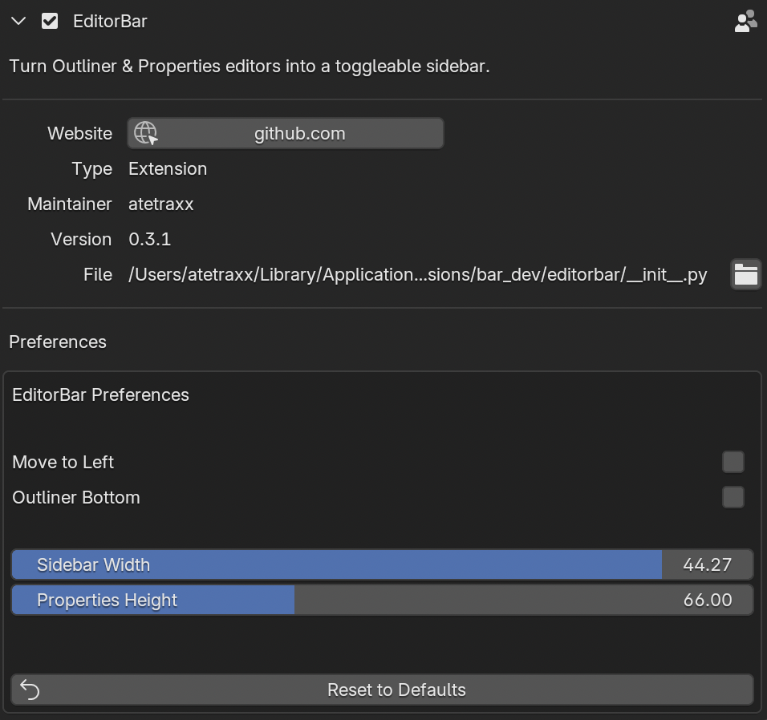
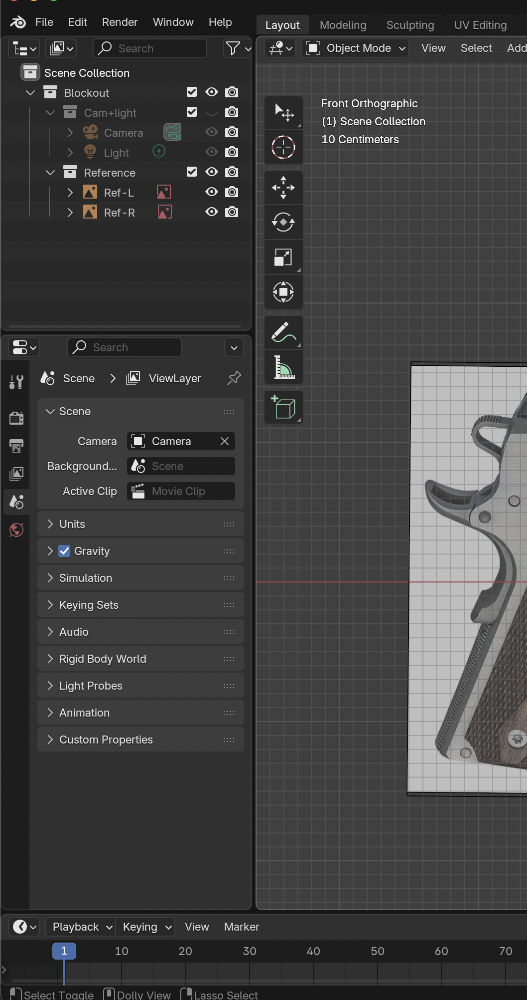

# Blender EditorBar

EditorBar is a Blender add-on that turns the default Outliner and Properties editors in Blender workspaces* into a sidebar that you can quickly collapse and expand. (*not all layouts are supported currently)

**Note**: EditorBar currently only works in 3D Viewport areas. The sidebar toggle is designed specifically for 3D Viewport workflows. (See Disclaimer at bottom of README.md for more information.)
**Version Note**: Developed and tested mostly in Blender 4.5. I have created bugfixes for 4.2-4.4 and should work but I have not done extensive testing. Please report any issues you encounter.

A common annoyance when working in blender, for me, is that there's no simple, intuitive way to collapse & expand the default outliner and properties editors in object and edit views. Those key editors are at default docked on the right and feel like they should be easily collapsable, but Blender doesn't provide that out of the box.

**This add-on fixes that.**

## Usage

There are three ways to toggle the sidebar:

- **3D Viewport Menu** at very bottom of menu
- **Sidebar button** a button residing within the N panel (View menu)
- **Keyboard shortcut:** <kbd>Alt</kbd>/<kbd>Opt</kbd> + <kbd>Shift</kbd> + <kbd>N</kbd>

You can activate the shortcut or click a button in the N panel 'View' menu to collapse & expand the 'sidebar'. By default, the shortcut is <kbd>Alt</kbd>/<kbd>Opt</kbd> + <kbd>Shift</kbd> + <kbd>N</kbd>, echoing Blender's own "N panel" sidebar shortcut.

**N-Panel Quick Options:**

## Customizing the Shortcut

Want a different shortcut?

1. Go to **Edit > Preferences > Keymap**
2. Search for `editorbar.toggle_sidebar` (or "Toggle EditorBar Sidebar")
3. Click on the keymap entry and assign any key combination you like

---

**Preference Settings:**

**Sidebar on Left Side:**

---

## Installation

### Method 1: Extensions (Blender 4.2+)

1. Download `editorbar.zip` from [Releases](https://github.com/JamesN-dev/blender-editorbar/releases/latest)
2. Open Blender → **Edit > Preferences > Get Extensions**
3. Click the dropdown arrow next to "Get Extensions" → **Install from Disk**
4. Select your downloaded `editorbar.zip`
5. Enable "EditorBar" in the extensions list

### Method 2: Legacy Add-ons (All Blender versions)

1. Download `editorbar.zip` from [Releases](https://github.com/JamesN-dev/blender-editorbar/releases/latest)
2. Open Blender → **Edit > Preferences > Add-ons**
3. Click **Install** → Select your downloaded `editorbar.zip`
4. Enable "EditorBar" in the add-ons list

That's it!

---

## Disclaimer

Blender EditorBar is optimized for layouts where Outliner and Properties editors are positioned on the right side of the screen, as in Blender’s default configurations. It is built and tested for these default workspace/layout presets (e.g., Layout - object & edit, Sculpting, Modeling, others). It does not yet reliably work in Shading, Animation, Compositing, Geo Nodes, or Scripting default workspaces. Updates for these layouts are planned.

This plugin is not for artists who utilize custom or heavily modified workspaces, such as non-standard editor splits, unusual panel placements, or floating editors, sidebar expansion and collapse may behave unpredictably.

Unexpected or undesired behavior may occur when used in custom setups. Future versions may support more dynamic layouts, but official layouts are the primary target.

For best results, use Blender EditorBar within Blender's official default workspace presets.

---

## License

GPL-3.0-or-later

---
